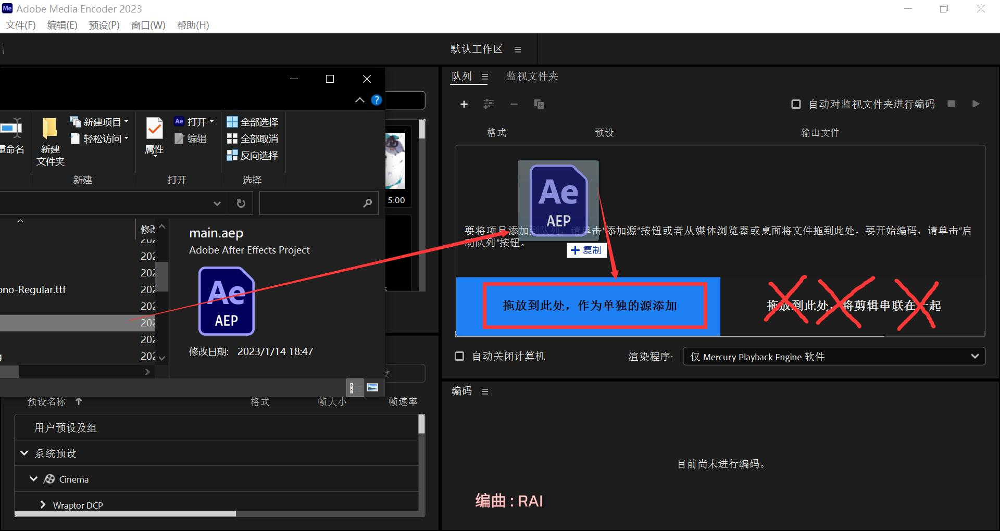

# Nhelv&PUPA 视频构建教程

项目包下载(*贼几把大!*):[https://drive.nuozhen.top:3232/lhsy.7z](https://drive.nuozhen.top:3232/lhsy.7z)

## 手元部分-必剪(BCut)实现

### Step1.复制文件

**请先确保已安装必剪且至少打开编辑视频一次。**

将`.\BCUt`目录中两个文件夹复制进`C:\Users\Administrator\Documents\Bcut Drafts`中。

### Step2.添加项目

打开`C:\Users\Administrator\Documents\Bcut Drafts\draftInfo.json`，在结尾 `}` 后添加半角逗号 `,` ，然后新启一行粘贴以下内容:

```json
        {
            "duration": 171919810,
            "id": "7E3EE6E8-FE54-4176-A56D-A86E48F52772",
            "modifyTime": 1673685235841,
            "name": "Nhelv",
            "storyLineId": ""
        },
        {
            "duration": 128114514,
            "id": "32ABD10D-5A61-4DDF-87C9-8735563B2F80",
            "modifyTime": 1673697553761,
            "name": "PUPA",
            "storyLineId": ""
        }
```

打开必剪，你应该可以看到两个手元的工程文件。

请注意所有素材都应该放在`D:\lhsy\`文件夹中，否则你需要在必剪中重新链接。

### 渲染导出

确保素材无遗漏后，点击右上角的导出按钮，设置好参数即可导出手元视频。

***⚠⚠⚠ 注意导出目录应放置在`.\Main Files\`中，文件名分别为`Nhelv.mp4` 和 `PUPA.mp4` (默认文件名就是这个，需要修改的是导出目录)，否则会影响下一步渲染。⚠⚠⚠***

## 转场、拼接部分-Adobe After Effects 2023实现

请先确保您已经安装`Adobe After Effects 2023`。

### Step1.安装依赖

打开`.\Main Files`目录，所有需要的文件都在里面。

找到所有带有`.ttf`后缀的TrueType字体文件，选择他们并右键安装。

### Step2.打开项目

>你不能直接通过`Adobe Media Encoder 2023`对项目进行渲染，因为部分素材可能未被正确链接。

打开`.\Main Files\main.aep`文件。

初次打开，视频文件应该会被自动链接，如果没有，选中任意实体素材，右键单击选择替换素材，链接到`.\Main Files\`中对应的素材。其它素材也会被自动识别并重链接。

>如果提示缺少字体，请确保第一步的依赖字体全部安装，若仍提示缺失，请根据缺失列表自行上网查询安装。

按下 <kbd>Ctrl</kbd>+<kbd>S</kbd> 保存。

### Step3.渲染导出

#### 使用Adobe After Effects Render Engine渲染

所有素材成功链接后，选中`主轨`合成，在菜单栏中找到`合成`-`添加到渲染队列`(或按下快捷键 <kbd>Ctrl</kbd>+<kbd>M</kbd> )，在渲染队列中，设置好参数，点击`渲染`按钮，等待渲染完成即可。

---

#### 使用Adobe Media Encoder 2023渲染

打开`Adobe Media Encoder 2023`，将你在第二步完成重链接的aep工程文件拖入`Adobe Media Encoder 2023`，注意拖入左半边作为单独的源添加，如图:


设置好参数，点击右上角开始按钮即可渲染导出。